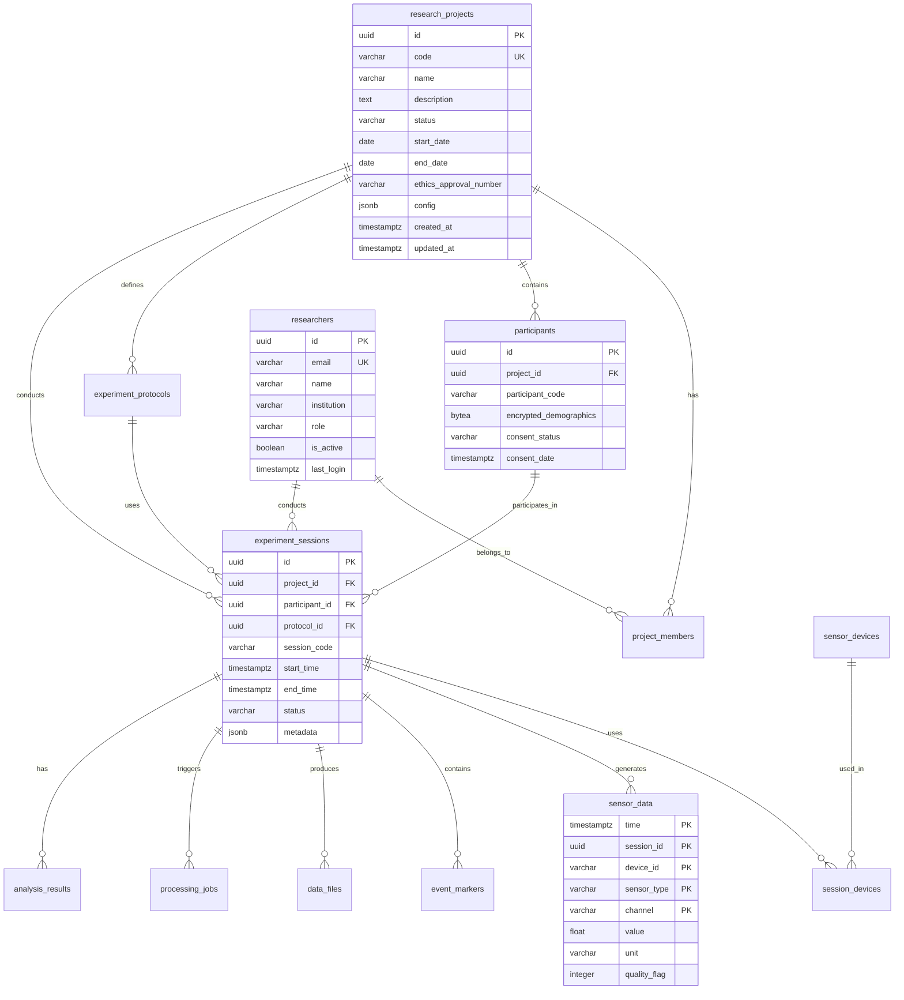

# データベーススキーマ設計書

## 概要

Research Platformのデータベース設計について、各テーブルの詳細仕様とリレーションシップを定義します。
本システムでは、PostgreSQL 15 + TimescaleDB を使用し、時系列データの効率的な管理を実現しています。

## データベース構成

- **メインDB**: `research_db` - アプリケーションデータ
- **認証DB**: `keycloak_db` - Keycloak用（別管理）
- **テストDB**: `research_test_db` - テスト環境用

## スキーマ構成

- `research`: メインのアプリケーションスキーマ
- `audit`: 監査ログ用スキーマ
- `public`: PostgreSQLデフォルトスキーマ

## ER図



## テーブル詳細

### 1. research_projects（研究プロジェクト）

研究プロジェクトの基本情報を管理します。

| カラム名 | データ型 | 制約 | 説明 |
|----------|----------|------|------|
| id | UUID | PK, DEFAULT gen_random_uuid() | プロジェクトID |
| code | VARCHAR(50) | UNIQUE, NOT NULL | プロジェクトコード |
| name | VARCHAR(255) | NOT NULL | プロジェクト名 |
| description | TEXT | | プロジェクト説明 |
| status | VARCHAR(50) | DEFAULT 'active' | ステータス（active/completed/paused/archived） |
| start_date | DATE | | 開始日 |
| end_date | DATE | | 終了日 |
| ethics_approval_number | VARCHAR(100) | | 倫理委員会承認番号 |
| config | JSONB | DEFAULT '{}' | プロジェクト固有設定 |
| created_at | TIMESTAMPTZ | DEFAULT NOW() | 作成日時 |
| updated_at | TIMESTAMPTZ | DEFAULT NOW() | 更新日時 |
| created_by | UUID | FK → researchers | 作成者 |

**インデックス:**
- `idx_projects_status` ON status WHERE status = 'active'
- `idx_projects_dates` ON (start_date, end_date)

### 2. researchers（研究者）

研究者のアカウント情報を管理します。

| カラム名 | データ型 | 制約 | 説明 |
|----------|----------|------|------|
| id | UUID | PK | 研究者ID |
| email | VARCHAR(255) | UNIQUE, NOT NULL | メールアドレス |
| name | VARCHAR(255) | NOT NULL | 氏名 |
| institution | VARCHAR(255) | | 所属機関 |
| department | VARCHAR(255) | | 部署 |
| orcid | VARCHAR(20) | | ORCID ID |
| role | VARCHAR(50) | DEFAULT 'researcher' | 役割（admin/pi/researcher/assistant） |
| is_active | BOOLEAN | DEFAULT true | アクティブフラグ |
| last_login | TIMESTAMPTZ | | 最終ログイン日時 |
| created_at | TIMESTAMPTZ | DEFAULT NOW() | 作成日時 |
| updated_at | TIMESTAMPTZ | DEFAULT NOW() | 更新日時 |

### 3. participants（被験者）

被験者情報を暗号化して管理します。

| カラム名 | データ型 | 制約 | 説明 |
|----------|----------|------|------|
| id | UUID | PK | 被験者ID |
| project_id | UUID | FK → research_projects | プロジェクトID |
| participant_code | VARCHAR(100) | NOT NULL | 被験者コード |
| encrypted_demographics | BYTEA | | 暗号化された人口統計データ |
| demographics_hash | VARCHAR(64) | | 検索用ハッシュ |
| consent_status | VARCHAR(50) | DEFAULT 'pending' | 同意状態 |
| consent_date | TIMESTAMPTZ | | 同意取得日 |
| consent_expiry_date | TIMESTAMPTZ | | 同意有効期限 |
| withdrawal_date | TIMESTAMPTZ | | 撤回日 |
| notes | TEXT | | 備考 |
| created_at | TIMESTAMPTZ | DEFAULT NOW() | 作成日時 |
| updated_at | TIMESTAMPTZ | DEFAULT NOW() | 更新日時 |

**制約:**
- UNIQUE(project_id, participant_code)

**インデックス:**
- `idx_participants_project` ON project_id
- `idx_participants_consent` ON consent_status
- `idx_participants_hash` ON demographics_hash

### 4. experiment_sessions（実験セッション）

実験セッションの実行情報を管理します。

| カラム名 | データ型 | 制約 | 説明 |
|----------|----------|------|------|
| id | UUID | PK | セッションID |
| project_id | UUID | FK → research_projects | プロジェクトID |
| participant_id | UUID | FK → participants | 被験者ID |
| protocol_id | UUID | FK → experiment_protocols | プロトコルID |
| session_code | VARCHAR(100) | NOT NULL | セッションコード |
| scheduled_time | TIMESTAMPTZ | | 予定時刻 |
| start_time | TIMESTAMPTZ | | 開始時刻 |
| end_time | TIMESTAMPTZ | | 終了時刻 |
| status | VARCHAR(50) | DEFAULT 'scheduled' | ステータス |
| environment_data | JSONB | DEFAULT '{}' | 環境データ（温度、湿度等） |
| metadata | JSONB | DEFAULT '{}' | メタデータ |
| notes | TEXT | | 備考 |
| quality_score | FLOAT | CHECK (0-1) | 品質スコア |
| created_by | UUID | FK → researchers | 作成者 |
| conducted_by | UUID | FK → researchers | 実施者 |
| created_at | TIMESTAMPTZ | DEFAULT NOW() | 作成日時 |
| updated_at | TIMESTAMPTZ | DEFAULT NOW() | 更新日時 |

**インデックス:**
- `idx_sessions_project` ON project_id
- `idx_sessions_participant` ON participant_id
- `idx_sessions_status` ON status
- `idx_sessions_time` ON (start_time, end_time)

### 5. sensor_data（センサーデータ）

時系列センサーデータを保存します（TimescaleDBハイパーテーブル）。

| カラム名 | データ型 | 制約 | 説明 |
|----------|----------|------|------|
| time | TIMESTAMPTZ | PK | タイムスタンプ |
| session_id | UUID | PK | セッションID |
| device_id | VARCHAR(255) | PK | デバイスID |
| sensor_type | VARCHAR(50) | PK | センサータイプ |
| channel | VARCHAR(50) | PK | チャンネル（x/y/z等） |
| value | DOUBLE PRECISION | NOT NULL | 測定値 |
| unit | VARCHAR(50) | | 単位 |
| quality_flag | INTEGER | DEFAULT 0 | 品質フラグ（0=良好、1=疑問、2=不良） |

**TimescaleDB設定:**
- チャンクサイズ: 1日
- 圧縮ポリシー: 7日経過後に自動圧縮

**インデックス:**
- `idx_sensor_data_session` ON session_id
- `idx_sensor_data_device` ON device_id
- `idx_sensor_data_type` ON sensor_type

### 6. experiment_protocols（実験プロトコル）

実験の手順とパラメータを定義します。

| カラム名 | データ型 | 制約 | 説明 |
|----------|----------|------|------|
| id | UUID | PK | プロトコルID |
| project_id | UUID | FK → research_projects | プロジェクトID |
| name | VARCHAR(255) | NOT NULL | プロトコル名 |
| version | VARCHAR(50) | DEFAULT '1.0.0' | バージョン |
| description | TEXT | | 説明 |
| protocol_data | JSONB | NOT NULL | プロトコル定義（JSON） |
| required_sensors | JSONB | DEFAULT '[]' | 必要なセンサーリスト |
| duration_minutes | INTEGER | | 予定時間（分） |
| is_active | BOOLEAN | DEFAULT true | 有効フラグ |
| is_template | BOOLEAN | DEFAULT false | テンプレートフラグ |
| created_by | UUID | FK → researchers | 作成者 |
| created_at | TIMESTAMPTZ | DEFAULT NOW() | 作成日時 |
| updated_at | TIMESTAMPTZ | DEFAULT NOW() | 更新日時 |

**制約:**
- UNIQUE(project_id, name, version)

### 7. processing_jobs（処理ジョブ）

バックグラウンド処理ジョブを管理します。

| カラム名 | データ型 | 制約 | 説明 |
|----------|----------|------|------|
| id | UUID | PK | ジョブID |
| session_id | UUID | FK → experiment_sessions | セッションID |
| job_type | VARCHAR(100) | NOT NULL | ジョブタイプ |
| priority | INTEGER | DEFAULT 5, CHECK (1-10) | 優先度 |
| status | VARCHAR(50) | DEFAULT 'pending' | ステータス |
| parameters | JSONB | DEFAULT '{}' | パラメータ |
| result | JSONB | | 処理結果 |
| error_message | TEXT | | エラーメッセージ |
| progress | FLOAT | DEFAULT 0, CHECK (0-100) | 進捗率 |
| created_at | TIMESTAMPTZ | DEFAULT NOW() | 作成日時 |
| queued_at | TIMESTAMPTZ | | キュー登録日時 |
| started_at | TIMESTAMPTZ | | 開始日時 |
| completed_at | TIMESTAMPTZ | | 完了日時 |
| created_by | UUID | FK → researchers | 作成者 |

**インデックス:**
- `idx_jobs_session` ON session_id
- `idx_jobs_status` ON status
- `idx_jobs_type` ON job_type

### 8. analysis_results（分析結果）

各種分析の結果を保存します。

| カラム名 | データ型 | 制約 | 説明 |
|----------|----------|------|------|
| id | UUID | PK | 結果ID |
| session_id | UUID | FK → experiment_sessions | セッションID |
| analysis_type | VARCHAR(100) | NOT NULL | 分析タイプ |
| version | VARCHAR(50) | DEFAULT '1.0.0' | 分析バージョン |
| parameters | JSONB | DEFAULT '{}' | 分析パラメータ |
| results | JSONB | NOT NULL | 分析結果 |
| quality_metrics | JSONB | DEFAULT '{}' | 品質指標 |
| created_at | TIMESTAMPTZ | DEFAULT NOW() | 作成日時 |
| created_by | UUID | FK → researchers | 作成者 |

### 9. audit_log（監査ログ）

すべての重要な操作を記録します（audit スキーマ）。

| カラム名 | データ型 | 制約 | 説明 |
|----------|----------|------|------|
| id | UUID | PK | ログID |
| timestamp | TIMESTAMPTZ | DEFAULT NOW() | タイムスタンプ |
| user_id | UUID | | ユーザーID |
| action | VARCHAR(100) | NOT NULL | アクション |
| resource_type | VARCHAR(100) | | リソースタイプ |
| resource_id | UUID | | リソースID |
| changes | JSONB | | 変更内容 |
| ip_address | INET | | IPアドレス |
| user_agent | TEXT | | ユーザーエージェント |
| success | BOOLEAN | DEFAULT true | 成功フラグ |
| error_message | TEXT | | エラーメッセージ |

**インデックス:**
- `idx_audit_user` ON user_id
- `idx_audit_resource` ON (resource_type, resource_id)
- `idx_audit_timestamp` ON timestamp

## 継続的集約ビュー

### sensor_data_hourly_stats

センサーデータの1時間ごとの統計情報を自動集計します。

```sql
CREATE MATERIALIZED VIEW sensor_data_hourly_stats
WITH (timescaledb.continuous) AS
SELECT
    time_bucket('1 hour', time) AS hour,
    session_id,
    device_id,
    sensor_type,
    channel,
    MIN(value) as min_value,
    MAX(value) as max_value,
    AVG(value) as avg_value,
    STDDEV(value) as std_dev,
    COUNT(*) as sample_count
FROM sensor_data
GROUP BY hour, session_id, device_id, sensor_type, channel;
```

## セキュリティ考慮事項

### 1. 暗号化

- `participants.encrypted_demographics`: AES-256で暗号化
- パスワード: bcryptでハッシュ化（Keycloak管理）
- 通信: TLS 1.3で暗号化

### 2. アクセス制御

- Row Level Security (RLS) の有効化
- プロジェクトベースのアクセス制御
- ロールベースの権限管理

### 3. 監査

- すべてのCRUD操作を監査ログに記録
- 個人情報へのアクセスを追跡
- 定期的な監査レポートの生成

## パフォーマンス最適化

### 1. インデックス戦略

- 頻繁に検索される外部キーにインデックス
- 複合インデックスによるクエリ最適化
- 部分インデックスによるサイズ削減

### 2. パーティショニング

- sensor_data: 時間ベースのパーティション（TimescaleDB自動）
- audit_log: 月次パーティション

### 3. バキューム設定

```sql
-- 自動バキュームの調整
ALTER TABLE sensor_data SET (
    autovacuum_vacuum_scale_factor = 0.01,
    autovacuum_analyze_scale_factor = 0.005
);
```

## メンテナンス

### 1. 定期タスク

- **日次**: 
  - インデックスの再構築
  - 統計情報の更新
  - 古いセッションデータのアーカイブ

- **週次**:
  - フルバキューム
  - 継続的集約ビューの更新

- **月次**:
  - パーティションの作成/削除
  - ストレージ使用量の確認

### 2. バックアップ戦略

- **継続的**: WALアーカイブ
- **日次**: 論理バックアップ（pg_dump）
- **週次**: 物理バックアップ（pg_basebackup）

## 今後の拡張計画

1. **機械学習対応**
   - 特徴量テーブルの追加
   - モデルバージョン管理

2. **マルチテナント対応**
   - テナントテーブルの追加
   - スキーマベースの分離

3. **国際化対応**
   - 翻訳テーブルの追加
   - タイムゾーン管理の強化