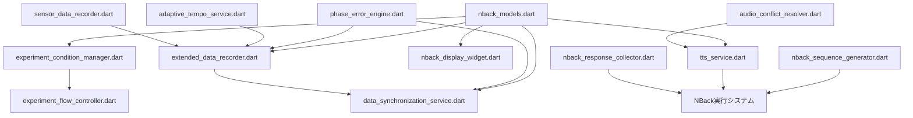

# 実装ファイル一覧

## 作成日: 2025-01-02

### Phase 0: 高優先度コンポーネント

| ファイルパス | 説明 | 主要クラス/機能 |
|------------|------|---------------|
| `/lib/services/adaptive_tempo_service.dart` | 適応的テンポ制御サービス | `AdaptiveTempoService`, `PhaseData` |
| `/lib/services/phase_error_engine.dart` | 位相誤差計算エンジン | `PhaseErrorEngine`, `PhaseErrorData` |
| `/lib/services/audio_conflict_resolver.dart` | 音声衝突解決サービス | `AudioConflictResolver`, `AudioEvent`, `ConflictLog` |
| `/lib/services/extended_data_recorder.dart` | 拡張データレコーダー | `ExtendedDataRecorder`, `ExtendedMetrics` |

### Phase 1: 基盤システム

| ファイルパス | 説明 | 主要クラス/機能 |
|------------|------|---------------|
| `/pubspec.yaml` | プロジェクト設定（更新） | flutter_tts, speech_to_text, audioplayers追加 |
| `/lib/models/nback_models.dart` | N-backデータモデル | `NBackConfig`, `NBackResponse`, `NBackSession`, `DualTaskExperimentSession` |

### Phase 2: N-backモジュール

| ファイルパス | 説明 | 主要クラス/機能 |
|------------|------|---------------|
| `/lib/services/nback_sequence_generator.dart` | N-back数字列生成 | `NBackSequenceGenerator` |
| `/lib/services/tts_service.dart` | 音声合成サービス | `TTSService`, `DigitSpeechHelper` |
| `/lib/services/nback_response_collector.dart` | 応答収集システム | `NBackResponseCollector`, `NBackUserInput` |
| `/lib/presentation/widgets/nback_display_widget.dart` | N-back表示UI | `NBackDisplayWidget`, `_DigitButton` |
| `/lib/presentation/screens/nback_settings_screen.dart` | N-back設定画面 | `NBackSettingsScreen` |

### Phase 3: 実験制御システム

| ファイルパス | 説明 | 主要クラス/機能 |
|------------|------|---------------|
| `/lib/services/experiment_condition_manager.dart` | 実験条件管理 | `ExperimentConditionManager`, `ExperimentCondition`, `ExperimentProgress` |
| `/lib/services/experiment_flow_controller.dart` | 実験フロー制御 | `ExperimentFlowController`, `ExperimentPhase`, `ExperimentFlowState` |
| `/lib/services/data_synchronization_service.dart` | データ同期サービス | `DataSynchronizationService`, `SynchronizedDataPoint`, `SynchronizationStatistics` |

## ファイル間の依存関係



## インポート関係

### 外部パッケージ依存
- `flutter_tts`: TTSService
- `speech_to_text`: NBackResponseCollector
- `audioplayers`: AudioConflictResolver（将来的に使用予定）
- `flutter_riverpod`: UI components
- `freezed_annotation`: nback_models.dart
- `csv`: extended_data_recorder.dart
- `path_provider`: extended_data_recorder.dart

### 内部依存
- ほとんどのサービスクラスは`nback_models.dart`に依存
- `ExtendedDataRecorder`は`SensorDataRecorder`を継承
- UI系は`flutter_riverpod`でサービスと連携（Provider未実装）

## 注意事項

1. **Freezedコード生成が必要**
   ```bash
   flutter pub run build_runner build --delete-conflicting-outputs
   ```

2. **権限設定が必要**
   - iOS: Info.plistにマイク権限
   - Android: AndroidManifest.xmlにRECORD_AUDIO権限

3. **統合時の考慮事項**
   - 既存の実験システムとの連携部分は未実装
   - Providerパターンでの状態管理は別途実装が必要